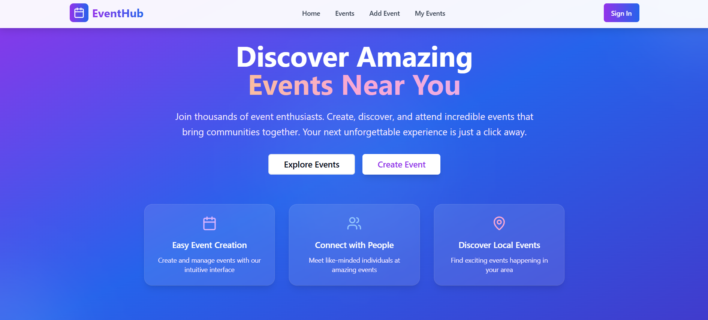

# EventHub - Event Management Web Application

<!--  -->

<!--  -->


## 🌟 Overview

EventHub is a comprehensive event management web application built with modern technologies. It provides a seamless platform for creating, discovering, and managing events with a focus on community building and user experience.

## ✨ Features

### 🎯 Core Functionality
- **Custom Authentication System** - Secure login and registration without third-party dependencies
- **Event Creation & Management** - Intuitive interface for creating and managing events
- **Event Discovery** - Browse and search events with advanced filtering options
- **User Profiles** - Personalized user experience with profile management
- **Real-time Updates** - Dynamic event participation and attendee tracking

### 🔍 Advanced Search & Filtering
- **Smart Search** - Search events by title, organizer, or keywords
- **Date-based Filters**:
  - Today's events
  - Current week
  - Last week
  - Current month
  - Last month
- **Custom Date Range** - Flexible date range selection

### 📱 User Interface
- **Responsive Design** - Optimized for all device sizes
- **Modern UI Components** - Built with shadcn/ui and Tailwind CSS
- **Consistent Theming** - Purple/blue gradient theme throughout
- **Smooth Animations** - Enhanced user experience with fluid transitions
- **Accessible Design** - WCAG compliant interface elements

### 🛡️ Security & Performance
- **Secure Authentication** - Custom-built authentication system
- **Data Validation** - Client-side and server-side validation
- **Error Handling** - Comprehensive error management and user feedback
- **Loading States** - Smooth loading indicators for better UX
- **Local Storage** - Efficient data persistence (ready for backend integration)

## 🚀 Pages & Routes

### Public Routes
- **Homepage (/)** - Landing page with hero section, features, testimonials, and newsletter
- **Login (/login)** - User authentication page
- **Register (/register)** - New user registration page

### Protected Routes (Authentication Required)
- **Events (/events)** - Browse all available events with search and filters
- **Event Details (/events/:id)** - Detailed view of individual events
- **Add Event (/add-event)** - Create new events
- **My Events (/my-events)** - Manage user's created events
- **Update Events (/update-events)** - Manage user's created events

## 🛠️ Technologies Used

### Frontend Framework
- **React 18** - Modern React with hooks and functional components
- **TypeScript** - Type-safe development
- **Vite** - Fast build tool and development server

### Styling & UI
- **Tailwind CSS** - Utility-first CSS framework
- **shadcn/ui** - Modern React component library
- **Lucide React** - Beautiful icon library
- **Custom Gradients** - Purple/blue theme throughout

### State Management & Routing
- **React Router DOM** - Client-side routing
- **React Context** - Global state management for authentication
- **TanStack React Query** - Server state management (ready for API integration)

### Development Tools
- **ESLint** - Code linting and formatting
- **PostCSS** - CSS processing
- **TypeScript** - Static type checking

## 📦 Installation & Setup

### Prerequisites
- Node.js (v18 or higher)
- npm or yarn package manager

### Quick Start
```bash
# Clone the repository
git clone <YOUR_GIT_URL>

# Navigate to project directory
cd eventhub

# Install dependencies
npm install

# Start development server
npm run dev

# Build for production
npm run build
```

### Environment Setup
The application uses local storage for data persistence. No additional environment variables are required for basic functionality.

## 🎨 Design System

### Color Palette
- **Primary**: Purple gradients (#7C3AED to #3B82F6)
- **Secondary**: Blue gradients (#3B82F6 to #6366F1)
- **Accent**: Pink/Purple gradients
- **Neutral**: Gray scale for text and backgrounds

### Typography
- **Headings**: Bold, gradient text for impact
- **Body**: Clean, readable sans-serif
- **UI Elements**: Consistent spacing and sizing

### Components
- **Cards**: Glassmorphism effect with backdrop blur
- **Buttons**: Gradient backgrounds with hover effects
- **Forms**: Modern input styling with floating labels
- **Navigation**: Clean, responsive navigation bar

## 🔧 Key Components

### Authentication Context
- Custom authentication provider
- User session management
- Protected route handling

### Event Management
- CRUD operations for events
- Real-time attendee tracking
- Event filtering and search

### UI Components
- Reusable component library
- Consistent styling system
- Responsive design patterns

## 📱 Responsive Design

EventHub is fully responsive and optimized for:
- **Desktop** - Full-featured experience
- **Tablet** - Adapted layouts and navigation
- **Mobile** - Touch-optimized interface


### Custom Domain
Connect your own domain through Project Settings > Domains (requires paid plan)

### Manual Deployment
```bash
# Build the application
npm run build

# Deploy the 'dist' folder to your hosting provider
```

## 🤝 Contributing

We welcome contributions! Please follow these steps:
1. Fork the repository
2. Create a feature branch
3. Make your changes
4. Submit a pull request

## 📄 License

This project is licensed under the MIT License - see the LICENSE file for details.

## 🎯 Future Enhancements

- **Backend Integration** - Connect to Supabase or custom API
- **Real-time Chat** - Event discussion features
- **Payment Integration** - Paid event ticketing
- **Social Features** - User connections and event sharing
- **Mobile App** - React Native companion app
- **Analytics Dashboard** - Event performance metrics

## 📞 Support

For support and questions:
- Email: jisan.sc@gmail.com

---

Made by Jawad Jisan. Happy event planning! 🎉

